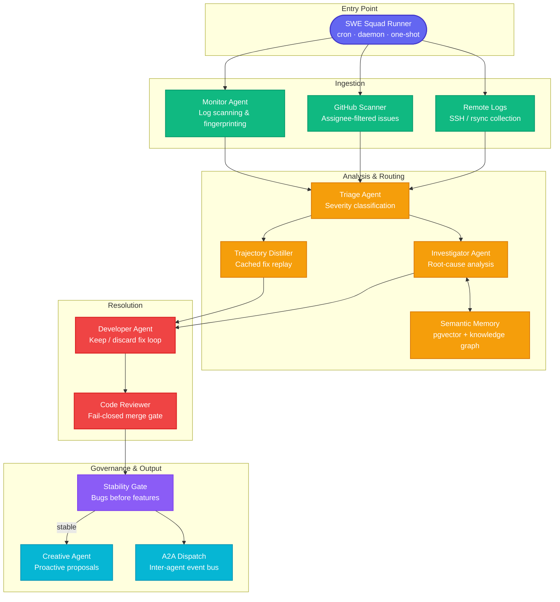
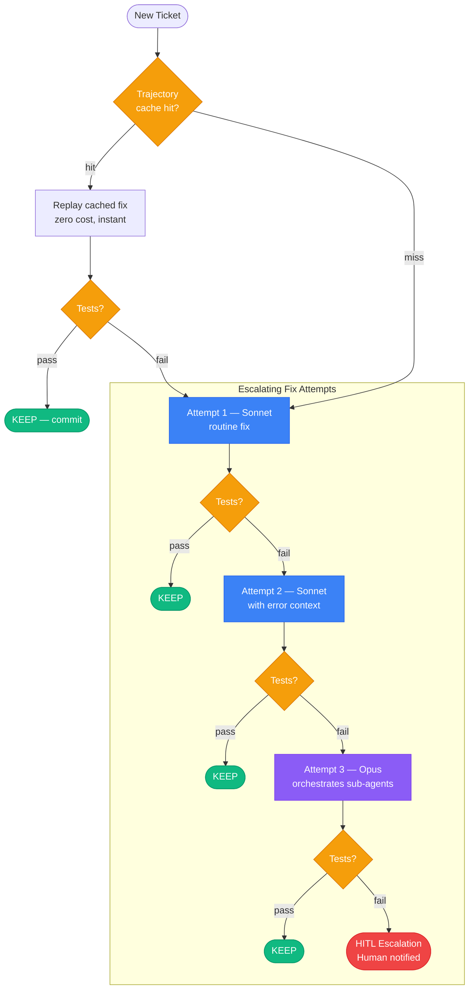

<p align="center">
  
</p>

<h1 align="center">SWE Squad</h1>

<p align="center">
  <em>An autonomous, provider-agnostic software engineering team that monitors, triages, and fixes bugs while you sleep.</em>
</p>

<p align="center">
  
  
  
  
</p>

<p align="center">
  <a href="https://github.com/ArtemisAI/SWE-Squad/stargazers">
    
  </a>
  &nbsp;&nbsp;
  <a href="https://github.com/ArtemisAI/SWE-Squad/network/members">
    
  </a>
</p>

---

> [!WARNING]
> **Run in a VM or container — do not run on your host machine.**
>
> SWE Squad is an agentic AI system with full access to your filesystem, shell, and git history. Like any tool in this class (Claude Code, Devin, OpenHands), it reads, writes, and executes files autonomously.
>
> **Recommended setup:**
> - **Docker** — use the provided `Dockerfile` / `docker-compose.yml` (see [Quick Start](#quick-start))
> - **VM** — a dedicated Linux VM with scoped credentials
> - **Cloud sandbox** — a fresh VPS or GitHub Codespace with only the keys it needs
>
> Scope your API keys and GitHub tokens to the minimum required permissions. Never give the agent a token with org-wide write access.

---

## What is SWE Squad?

SWE Squad is a team of AI agents that autonomously monitors your production systems, detects issues, and fixes them — with human-in-the-loop escalation at every critical decision point.

Unlike single-agent coding tools, SWE Squad operates as a **coordinated pipeline** where each agent has a specialized role: monitoring ingests logs and GitHub issues, triage classifies severity and routes work, investigation performs root-cause analysis, and the developer agent attempts fixes on isolated git branches — discarding any that fail tests. A stability gate (Ralph Wiggum) blocks new feature work until the error backlog is clear.

The system is built around a **provider-agnostic plugin architecture**: every external dependency — coding engine, notification channel, issue tracker, sandbox, vector store — is behind a swappable interface. You bring your own tools; SWE Squad orchestrates them.

---

## Key Features

- **Provider-agnostic plugin architecture** — 12 domain interfaces, 20+ built-in implementations. Swap any component without touching core logic.
- **Multi-team support** — multiple squads share a Supabase backend with full isolation via `team_id` and assignee-based issue pickup. Alpha and beta squads never collide.
- **Session lifecycle management** — investigation and development sessions persist across daemon cycles. Developer sessions fork from investigator sessions, carrying full context forward.
- **Parallel execution with git worktree isolation** — each fix attempt runs in its own worktree; tests pass → commit, tests fail → auto-revert. No broken code reaches main.
- **Semantic memory** — resolved tickets are embedded (bge-m3, 1024-dim) and stored in a pgvector knowledge base. Top-5 similar past fixes are injected into every investigation prompt, confidence-weighted.
- **Knowledge graph scoring** — graph-based relationship scoring between tickets surfaces non-obvious connections across modules and error classes.
- **GitHub OAuth dashboard** — optional WebUI with user management, live metrics, and control plane API for runtime configuration (sessions, projects, model tiers).
- **A2A inter-agent protocol** — JSON-RPC 2.0 event bus for cross-agent coordination. Includes server, client, and adapters for Gemini CLI, OpenCode, and generic CLI agents.
- **Circuit breaker + exponential backoff** — if development failures exceed 80%, the daemon pauses for 30 minutes. All LLM calls use capped exponential backoff.
- **Automated code review** — every fix PR is reviewed before merge with a fail-closed policy. Code review failures block the merge.
- **Credential scanner** — pre-commit hook and inline scanner detect secrets before they reach git history.
- **Model routing** — Haiku for cheap tasks, Sonnet for routine fixes, Opus as orchestrator-only for critical tickets. After two Sonnet failures, auto-escalate to Opus.
- **Deterministic replay** — successful fix trajectories are cached by error fingerprint for zero-cost instant replay.

---

## Architecture

The pipeline flows from log ingestion through triage, investigation, development, and governance:



### Fix Loop

Each fix attempt runs on a git branch. Tests pass → commit. Tests fail → `git reset --hard`. No broken code ever reaches main.



---

## Quick Start

```bash
# 1. Clone and install
git clone https://github.com/ArtemisAI/SWE-Squad.git
cd SWE-Squad
pip install python-dotenv pyyaml

# 2. Configure
cp .env.example .env
# Edit .env — set SWE_TEAM_ENABLED, SWE_TEAM_ID, GH_TOKEN, SWE_GITHUB_ACCOUNT, SWE_GITHUB_REPO

# 3. Bootstrap (acknowledge pre-existing errors on first run)
python scripts/ops/swe_team_runner.py --bootstrap -v

# 4. Run a single scan cycle
python scripts/ops/swe_team_runner.py -v

# 5. Start the daemon (continuous 30-minute cycles)
python scripts/ops/swe_team_runner.py --daemon -v

# 6. Run tests
python -m pytest tests/unit/ -q
```

For Docker:

```bash
docker compose up -d
```

---

## Configuration

### Required Environment Variables

| Variable | Description |
|----------|-------------|
| `SWE_TEAM_ENABLED` | Kill switch — must be `true` to run |
| `SWE_TEAM_ID` | Unique team identifier for ticket scoping |
| `SWE_GITHUB_ACCOUNT` | Dedicated GitHub bot account for issue pickup |
| `SWE_GITHUB_REPO` | Target repository (`owner/repo`) |
| `GH_TOKEN` | GitHub PAT with `repo` scope |

### Optional Environment Variables

| Variable | Description |
|----------|-------------|
| `TELEGRAM_BOT_TOKEN` / `TELEGRAM_CHAT_ID` | Alert notifications |
| `SUPABASE_URL` / `SUPABASE_ANON_KEY` | Shared multi-team ticket store |
| `BASE_LLM_API_URL` / `BASE_LLM_API_KEY` | OpenAI-compatible proxy for embeddings |
| `EMBEDDING_MODEL` | Embedding model name (default: `bge-m3`) |
| `SWE_MODEL_T1/T2/T3` | Override model tiers (default: haiku/sonnet/opus) |
| `SWE_REMOTE_NODES` | JSON array of SSH worker nodes |

See `.env.example` for the full list. Runtime configuration is in `config/swe_team.yaml`.

---

## Provider Architecture

SWE Squad is provider-agnostic: every external service is behind a swappable interface. New provider = new file in `src/swe_team/providers/<domain>/` + entry in `swe_team.yaml`. Nothing else changes.

| Domain | Interface | Default Implementation | Alternatives |
|--------|-----------|----------------------|--------------|
| Coding engine | `CodingEngine` | Claude Code CLI | Gemini CLI, OpenCode |
| Notification | `NotificationProvider` | Telegram | Slack, PagerDuty, webhook |
| Issue tracker | `IssueTracker` | GitHub Issues | GitLab, Jira, Linear |
| Sandbox | `SandboxProvider` | Docker / local subprocess | Proxmox, cloud VM |
| Auth | `AuthProvider` | GitHub OAuth | Custom JWT, API key |
| Embeddings | `EmbeddingProvider` | bge-m3 via BASE_LLM | OpenAI, local sentence-transformers |
| Vector store | `VectorStore` | Supabase pgvector | Qdrant, Weaviate, Chroma |
| Workspace | `WorkspaceProvider` | git-worktree | Docker volume, noop |
| Repo map | `RepoMapProvider` | ctags | tree-sitter, file listing |
| Task queue | `TaskQueueProvider` | In-memory (heapq) | Redis, RabbitMQ, SQS |
| Usage governor | `UsageGovernor` | Built-in token budget | Custom rate limiter |
| Log query | `LogQueryProvider` | Local file scanner | CloudWatch, Loki, Datadog |

---

## Dashboard (Optional)

The WebUI is an optional plugin (`src/swe_team/control_plane_api.py`). When enabled, it provides:

- Live ticket queue with severity and status filters
- Session browser — active and suspended Claude Code sessions
- Project configuration editor (model tiers, priority weights, sandbox paths)
- User management with role-based access control (GitHub OAuth)
- Control plane API for runtime reconfiguration without restart

To enable:

```bash
python scripts/ops/swe_team_runner.py --daemon --enable-dashboard --port 8080
```

The dashboard is not required for the agent pipeline to function.

---

## Multi-Team Support

Multiple squads can operate on shared infrastructure with full isolation:

- Each squad has its own `SWE_TEAM_ID` — all tickets are scoped to it in Supabase
- Issue pickup is **assignee-based only**: a squad only processes issues assigned to its bot account
- Squads share the semantic memory knowledge base — cross-team patterns improve investigation quality
- Independent daemon processes, independent `.env` files, independent GitHub bot accounts

---

## Contributing

Contributions are welcome. See [CONTRIBUTING.md](CONTRIBUTING.md) for guidelines, branch conventions, and the test requirement (`make test` must pass with zero failures).

Areas that would benefit from community input:

- Additional provider implementations (Slack notifications, Linear issue tracker, Qdrant vector store)
- CI/CD integration (GitHub Actions, GitLab CI)
- Agent prompt optimization and benchmarking
- Documentation and tutorials

---

## License

[MIT](LICENSE) — use it, fork it, build on it.

---

## Community

- [GitHub Discussions](https://github.com/ArtemisAI/SWE-Squad/discussions) — questions, ideas, show-and-tell
- [Issues](https://github.com/ArtemisAI/SWE-Squad/issues) — bug reports and feature requests
- [Contributing Guide](CONTRIBUTING.md) — how to submit a PR

<p align="center">
  <sub>Made with care by <a href="https://github.com/ArtemisAI">ArtemisAI</a></sub>
</p>
