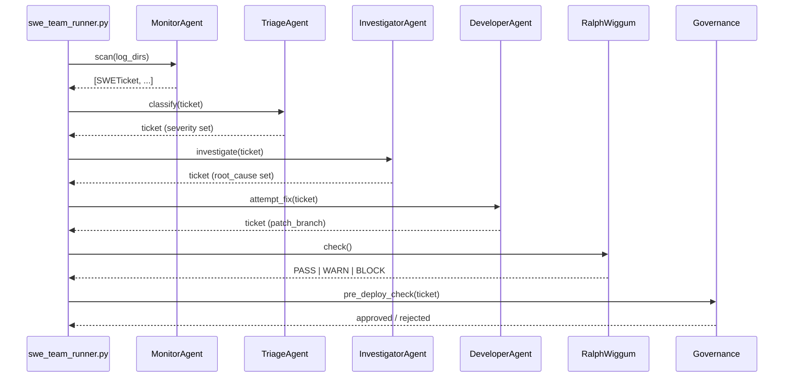
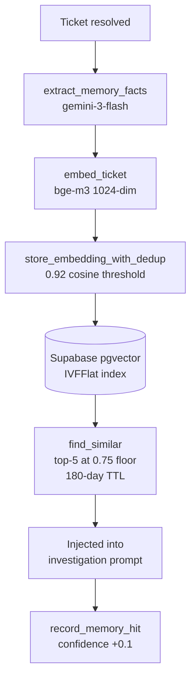

# Architecture

## System overview

SWE-Squad is a pipeline of autonomous agents coordinated by a central runner. Each agent is a focused Python module with a single responsibility. Agents communicate via the A2A (Agent-to-Agent) event protocol and share state through the ticket store (JSON or Supabase).

```
scripts/ops/swe_team_runner.py   — Entry point. Runs one cycle or daemon loop.
src/swe_team/
    monitor_agent.py   — Log scanning + fingerprint dedup
    triage_agent.py    — Severity classification + assignment
    investigator.py    — Root-cause via Claude CLI + semantic memory
    developer.py       — Auto-fix: branch → patch → test → keep/discard
    ralph_wiggum.py    — Stability gate: block/warn/pass
    governance.py      — Deployment governor, complexity gates
    ticket_store.py    — JSON file-backed persistence (default)
    supabase_store.py  — Supabase PostgREST persistence (optional)
src/a2a/               — A2A protocol: server, client, dispatch, adapters
```

## Pipeline diagram



## Agent roles

| Agent | Tier | Model | Responsibility |
|-------|------|-------|----------------|
| MonitorAgent | — | None | Log scanning, fingerprint dedup |
| TriageAgent | T1 | gemini-3-flash | Severity + issue type classification |
| InvestigatorAgent | T2/T3 | sonnet / opus | Root-cause via Claude CLI |
| DeveloperAgent | T2/T3 | sonnet → opus | Fix, branch, test loop |
| RalphWiggum | — | None | Error-rate stability gate |
| Governance | — | None | Complexity + deployment gates |
| CreativeAgent | T2 | sonnet | Proactive improvement proposals |

## Model routing

```
Embeddings / fact extraction  →  gemini-3-flash via BASE_LLM proxy
Routine HIGH bugs             →  claude-sonnet (Claude CLI subprocess)
CRITICAL bugs                 →  claude-opus  (Claude CLI subprocess)
After 2 Sonnet failures       →  auto-escalate to opus
Regression tickets            →  always opus
Cached fix replay             →  no model (TrajectoryDistiller)
```

!!! warning "Two-system distinction"
    `BASE_LLM_API_URL` (OpenAI-compatible HTTP proxy) and the `claude` CLI are **separate systems**.
    Never call the Claude CLI from library code (`embeddings.py`, `supabase_store.py`).
    Never call a Claude model name via the BASE_LLM proxy.

## Semantic memory pipeline



## A2A hub

SWE Squad registers with a centralized A2A Hub for cross-agent coordination:

```
LinkedAi A2A Hub: http://100.110.176.73:18790
├── Protocol: JSON-RPC 2.0 over HTTP POST
├── Registered agents: openclaw, gemini, llm_proxy, swe-squad
├── Discovery: GET /health, GET /.well-known/agent-card.json
└── Events: POST /v1/events
```

If the hub is unreachable, `src/a2a/dispatch.py` falls back to a local standalone server (`src/a2a/server.py`).

## Remote worker log pipeline

```
Every monitor cycle:
  swe_team_runner.py
    → collect_remote_logs()
    → rsync -az -e "ssh -F config/ssh_workers.conf"
    → logs/remote/{worker-name}/*.log
    → appended to monitor.log_directories
    → MonitorAgent.scan() picks them up automatically
```

Workers are configured in `config/swe_team.yaml` under `monitor.remote_workers`. The SSH config at `config/ssh_workers.conf` uses `IdentitiesOnly yes` and a dedicated ed25519 key so only listed workers are reachable.
