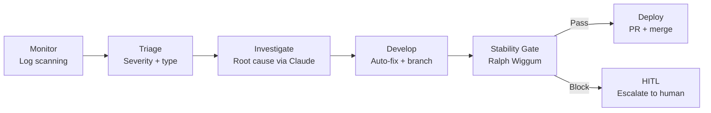

# SWE-Squad

**Autonomous Software Engineering Agents — self-healing, self-diagnosing development powered by Claude Code**

[](https://python.org)
[](LICENSE)
[](https://github.com/ArtemisAI/SWE-Squad/stargazers)

SWE-Squad is a multi-agent system that monitors your codebase, triages issues, investigates root causes, proposes fixes, and enforces a stability gate — autonomously.

## What it does



## Quick start

```bash
git clone https://github.com/ArtemisAI/SWE-Squad.git
cd SWE-Squad
pip install pyyaml python-dotenv
cp .env.example .env  # fill in your keys
python3 -m pytest tests/unit/ -q  # verify: all tests pass
python3 scripts/ops/swe_team_runner.py  # run one cycle
```

## Key features

| Feature | Description |
|---------|-------------|
| **Log monitoring** | Scans local + remote logs, deduplicates via fingerprints |
| **AI investigation** | Claude Sonnet/Opus root-cause analysis with semantic memory |
| **Auto-fix** | Branch creation, fix attempts, keep/discard loop |
| **Stability gate** | Blocks deploys when error rate is too high |
| **RBAC** | Deny-by-default agent permission system |
| **Scheduler** | Cron-based, quota-aware, peak-hour-aware job runner |
| **Token tracking** | Per-ticket cost accounting with budget caps |
| **A2A protocol** | Inter-agent communication hub |

## How it works

Every cycle the runner orchestrates a pipeline:

1. **Monitor** — scans log directories (local and remote SSH workers) for error patterns and creates deduplicated tickets.
2. **Triage** — classifies each ticket by severity (`LOW`/`MEDIUM`/`HIGH`/`CRITICAL`) and issue type, assigns to an agent.
3. **Investigate** — runs root-cause analysis via Claude CLI, enriched with semantic memory from past tickets.
4. **Develop** — attempts an automated fix on a feature branch; runs tests; discards bad patches.
5. **Stability gate** — Ralph Wiggum blocks new feature work when the error rate exceeds thresholds.
6. **Govern** — deployment governor checks complexity, token usage, and regression risk before merging.

## Requirements

- Python 3.10+
- `pyyaml`, `python-dotenv` (core — no other mandatory runtime deps)
- `claude` CLI (Anthropic Claude Code) in `PATH`
- Optional: Supabase account (semantic memory), Telegram bot (notifications)

## License

MIT — see [LICENSE](https://github.com/ArtemisAI/SWE-Squad/blob/main/LICENSE).
